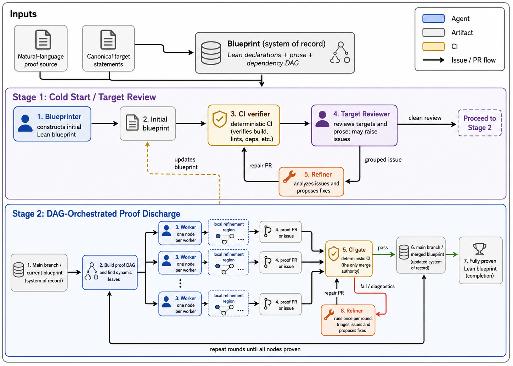
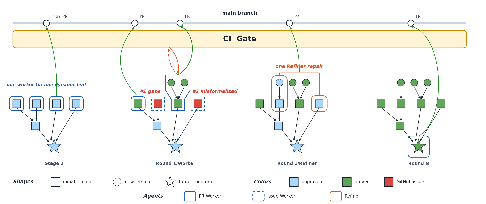

# LeanMarathon

<p align="center">
  
</p>

LeanMarathon is an multi-agent harness system for turning a natural-language mathematical proof into fully-proven Lean 4 blueprint with parallel Codex agents. [[Paper]](paper.pdf)



LeanMarathon manages GitHub repositories, sparse worktrees, Slurm jobs, Codex agent workspaces, runtime inputs, audit logs, and CI handoffs. User can operate the system through `leanmarathon` commands and a small local config file.

## Deliveries

| Target | Result |
| --- | --- |
| [Erdős-Graham](https://arxiv.org/abs/2601.21442) | [ErdosGraham](https://github.com/YuanheZ/ErdosGraham) |
| [Erdős #1196](https://arxiv.org/abs/2605.00301) | [Erdos1196](https://github.com/YuanheZ/Erdos1196) |
| [Erdős #164 & #1217](https://arxiv.org/abs/2605.00301) | [Prim](https://github.com/YuanheZ/Prim) |

## Repository Layout

| Path | Purpose |
| --- | --- |
| `src/leanmarathon/cli.py` | User-facing CLI: `init`, `auto`, `stage1 run`, `stage2 run`, `status`, and `doctor`. |
| `.scripts/create-worktree.sh` | Creates sparse Git worktrees for agent branches. |
| `.scripts/stage1_blueprint_loop.py` | Slurm-backed Stage 1 Blueprinter / Target-Reviewer / Refiner loop. |
| `.scripts/per_node_worker_loop.py` | Slurm-backed Stage 2 Worker / Refiner loop. |
| `.scripts/verify_blueprint.py` | CI and local verifier for LeanArchitect blueprint files. |
| `agents/Blueprinter/` | Codex workspace template for initial blueprint generation. |
| `agents/Target-Reviewer/` | Codex workspace template for target review. |
| `agents/Refiner/` | Codex workspace template for blueprint and blocker repair. |
| `agents/Worker/` | Codex workspace template for one-node proof work. |
| `mcp-servers/apply-patch/` | Local MCP server for scoped patch application. |
| `mcp-servers/dag-tracker/` | Local MCP server for proof-DAG context queries. |
| `workflows/verify-blueprint.yml` | GitHub Actions template copied into target repos. |
| `workflows/warmup-cache.yml` | Optional cache warmup workflow copied into target repos. |
| `config/local.example.toml` | Local machine/cluster config template. |
| `docs/params.md` | CLI command argument reference. |
| `tests/` | Regression tests for prompt plumbing and verifier comment hygiene. |

## Agent Roles

| Role | Branch pattern | Delivery |
| --- | --- | --- |
| Blueprinter | `blueprint/init` | Creates the initial blueprint and delivers a CI-green PR merged into `main`. |
| Target-Reviewer | `target-review/round-<n>` | Reviews target statements and either exits cleanly or files a grouped issue. |
| Refiner | `blueprint-refiner/round-<n>` in Stage 1, `refiner/round-<n>` in Stage 2 | Repairs open issues and delivers a CI-green PR merged into `main`. |
| Worker | `round-<n>/<target_node>` | Proves one dynamic leaf in Stage 2, or files a blocker issue. |

Blueprinter, Refiner, and successful Worker jobs use Codex stop hooks. A stop hook keeps the agent alive until its PR is CI-green and merged. Target-Reviewer and blocked Workers may finish by filing an issue.

Default Codex start prompts are:

| Role | Default prompt |
| --- | --- |
| Blueprinter | `Begin from Phase 1` |
| Target-Reviewer | `Begin the work.` |
| Refiner | `Begin from Phase 1` |
| Worker | `Begin from Phase 1` |

Custom prompts can be provided at `leanmarathon init` with `--blueprinter-prompt`, `--target-reviewer-prompt`, `--refiner-prompt`, and `--worker-prompt`. Defaults are not written to prompt files; custom prompts are stored in the local target config and materialized inside each agent worktree so the agent doesn't lose the context after auto-compaction.

## Requirements

LeanMarathon expects the following tool versions:

| Tool | Expected version |
| --- | --- |
| Codex CLI | `0.128.0` |
| `lean-lsp-mcp` | `0.26.2` |
| `lean-explore` | `1.2.1` |
| `github-mcp-server` | `0.32.0` |
| `git-mcp-server` | `2.10.5` |

LeanMarathon does not pin the Lean version. You must provide a Lean project root containing:

```text
lakefile.toml
lake-manifest.json
lean-toolchain
```

That Lean project root is also where local Lean tooling and `.lake` cache state are used. LeanMarathon worktrees are created under:

```text
<lean_project_root>/.leanmarathon-worktrees/<owner>/<repo>/
```

Mandatory Python PDF imports:

| Import | Use |
| --- | --- |
| `pdfplumber` | Default PDF text extraction for math papers. |
| `fitz` | PyMuPDF page inspection and fallback extraction. |
| `pdfminer.high_level` | Lower-level PDF text extraction. |
| `pypdf` | Pure-Python PDF fallback. |
| `PyPDF2` | Older PDF fallback. |
| `pypdfium2` | PDFium rendering and fallback extraction. |

Optional numeric packages are auto-detected during `leanmarathon init`. LeanMarathon checks this known import list and exposes only installed rows to agents:

```text
numpy scipy sympy numba torch mpmath pandas matplotlib networkx pulp ortools highspy pysat cvxpy osqp clarabel sklearn faiss
```

## Install

Clone the system repo and install the Python CLI:

```bash
git clone <LeanMarathon repo URL> LeanMarathon
cd LeanMarathon

python3 -m venv .venv
. .venv/bin/activate
pip install -e .
```

Install the external MCP servers and Codex CLI according to your environment. LeanMarathon ships only the local `apply-patch` and `dag-tracker` MCP servers. The following MCP servers are external tools and must be installed separately:
- lean-lsp-mcp
- lean-explore
- github-mcp-server
- git-mcp-server

Then run:

```bash
leanmarathon doctor
```

`doctor` checks command availability, expected tool versions where possible, mandatory PDF imports, and optional numeric imports.

## Local Machine Config

Create a local config file:

```bash
cp config/local.example.toml .leanmarathon.local.toml
```

Edit `.leanmarathon.local.toml`:

```toml
[paths]
venv_bin = "/absolute/path/to/LeanMarathon/.venv/bin"
node_bin = "/absolute/path/to/node/bin"
elan_bin = "/absolute/path/to/elan/bin"
# Optional full overrides when the composed PATH is not enough.
# agent_path = "/absolute/path/to/venv/bin:/absolute/path/to/node/bin:/absolute/path/to/elan/bin:/usr/local/bin:/usr/bin:/bin"
# orchestrator_path = "/absolute/path/to/venv/bin:/absolute/path/to/node/bin:/absolute/path/to/elan/bin:/usr/local/bin:/usr/bin:/bin"

[lean]
project_root = "/absolute/path/to/lean-project"

[slurm]
cpu_account = ""
gpu_account = ""
gpu_partition = "gpu"
gpu_gres = "gpu:lovelace_l40:1"
mem_per_cpu = 3850
```

The default composed PATH is:

```text
paths.venv_bin : paths.node_bin : paths.elan_bin : /usr/local/bin : /usr/bin : /bin
```

You can point LeanMarathon at a different local config with:

```bash
export LEANMARATHON_CONFIG=/absolute/path/to/local.toml
```

Environment variables override local config values:

| Environment variable | Config field |
| --- | --- |
| `LEANMARATHON_VENV_BIN` | `paths.venv_bin` |
| `LEANMARATHON_NODE_BIN` | `paths.node_bin` |
| `LEANMARATHON_ELAN_BIN` | `paths.elan_bin` |
| `LEANMARATHON_AGENT_PATH` | `paths.agent_path` |
| `LEANMARATHON_ORCH_PATH` | `paths.orchestrator_path` |
| `LEANMARATHON_LEAN_PROJECT_ROOT` | `lean.project_root` |
| `LEANMARATHON_SLURM_CPU_ACCOUNT` | `slurm.cpu_account` |
| `LEANMARATHON_SLURM_GPU_ACCOUNT` | `slurm.gpu_account` |
| `LEANMARATHON_SLURM_GPU_PARTITION` | `slurm.gpu_partition` |
| `LEANMARATHON_SLURM_GPU_GRES` | `slurm.gpu_gres` |
| `LEANMARATHON_SLURM_MEM_PER_CPU` | `slurm.mem_per_cpu` |

## GitHub Auth

Authenticate with `gh`:

```bash
gh auth login
```

or export a LeanMarathon-specific token:

```bash
export LEANMARATHON_GITHUB_TOKEN=...
```

Required GitHub permissions:

| Permission area | Needed for |
| --- | --- |
| Contents read/write | Push branches and initialize target repos. |
| Pull requests read/write | Open and merge agent PRs. |
| Issues read/write | File and close review/blocker issues. |
| Actions/workflows read/write | Install and trigger copied CI workflows. |

**Safety:** Do not put GitHub tokens in `.leanmarathon.local.toml`, README files, agent configs, or committed target files. Generated Slurm jobs inherit a token from `LEANMARATHON_GITHUB_TOKEN` or from `gh auth token`; token values are not written into generated job scripts.

## Initialize A Target Repo

Prepare:

| Input | Meaning |
| --- | --- |
| `problem_file` | Canonical target statements. |
| `proof_file` | Natural-language proof source. This may be a file or a directory. |
| `lean_project_root` | Existing Lean project root containing Lake metadata and dependencies. |

Create and initialize a private GitHub target repo:

```bash
leanmarathon init \
  --owner MyGitHubName \
  --repo MyTargetRepo \
  --problem-file /absolute/path/to/problem.txt \
  --proof-file /absolute/path/to/proof-source \
  --lean-project-root /absolute/path/to/lean-project
```

If `lean.project_root` is already set in `.leanmarathon.local.toml`, the `--lean-project-root` argument can be omitted.

Useful initialization options:

```bash
leanmarathon init \
  --owner MyGitHubName \
  --repo MyTargetRepo \
  --problem-file /absolute/path/to/problem.txt \
  --proof-file /absolute/path/to/proof-source \
  --public \
  --lean-file LeanMarathon/Main.lean \
  --auto-resource cpu \
  --auto-cpus 1 \
  --auto-time 48:00:00 \
  --stage1-orchestrator-resource cpu \
  --stage1-orchestrator-cpus 1 \
  --stage1-orchestrator-time 48:00:00 \
  --orchestrator-resource gpu \
  --orchestrator-cpus 42 \
  --orchestrator-time 48:00:00 \
  --agent-resource gpu \
  --agent-cpus 42 \
  --agent-time 4:00:00 \
  --batch-size 16 \
  --max-review-rounds 20 \
  --max-rounds 100
```

`--orchestrator-*` configures the Stage 2 Worker-loop orchestrator. Stage 1 has its own `--stage1-orchestrator-*` options. `--auto-*` configures the optional parent end-to-end Slurm job.

By default target repos are private. Use `--public` only when you want a public target repo.

## What `init` Creates

In the target GitHub repo, LeanMarathon commits:

```text
.gitignore
lakefile.toml
lake-manifest.json
lean-toolchain
LeanMarathon/Main.lean
.github/workflows/verify-blueprint.yml
.github/workflows/warmup-cache.yml
.scripts/verify_blueprint.py
```

Local runtime state is created in the LeanMarathon system repo:

| Path | Meaning |
| --- | --- |
| `.orchestrator-repos/<owner>/<repo>/` | Local clone of the target repo used as the per-target orchestration root. |
| `.leanmarathon-targets/<owner>/<repo>/config.toml` | Local target config written by `leanmarathon init`. |
| `.leanmarathon-targets/<owner>/<repo>/inputs/` | Local copies of `problem_file` and `proof_file`. |

Agent worktrees are created under the configured Lean project root:

```text
<lean_project_root>/.leanmarathon-worktrees/<owner>/<repo>/
```

Per-run audit logs and Slurm scripts are written inside the local target clone:

```text
.orchestrator-repos/<owner>/<repo>/.orchestrator-runs/
```

Codex session history for jobs is isolated under:

```text
.orchestrator-repos/<owner>/<repo>/.codex-session-home/
```

After each agent job exits, the generated job script prunes the isolated Codex home, preserving Codex session `.jsonl` files. Worktree and feature-branch cleanup only runs when Codex exits successfully after a terminal delivery; failed or non-terminal jobs keep their worktrees and branches for debugging.

## Run End To End

The command is:

```bash
leanmarathon auto --owner MyGitHubName --repo MyTargetRepo
```

By default, this submits one parent Slurm job. The parent job submits Stage 1, waits for Stage 1 to finish, submits Stage 2, and waits for Stage 2 to finish. To run the parent coordinator in the current terminal while still submitting Stage 1 and Stage 2 as Slurm jobs:

```bash
leanmarathon auto --owner MyGitHubName --repo MyTargetRepo --no-submit
```

## Stage 1: Blueprint Generation And Review

Run Stage 1 directly:

```bash
leanmarathon stage1 run --owner MyGitHubName --repo MyTargetRepo
```

`--no-submit` runs the Stage 1 orchestrator in the current terminal instead of submitting the orchestrator itself to Slurm. Agent jobs are still Slurm jobs.

## Stage 2: DAG-orchestrated Loop

Run Stage 2 directly:

```bash
leanmarathon stage2 run --owner MyGitHubName --repo MyTargetRepo
```



## Slurm Resource Model

LeanMarathon uses Slurm for:

| Job type | Config section | Default |
| --- | --- | --- |
| Parent `auto` job | `[hpc.auto]` | CPU, 1 core, 48 hours |
| Stage 1 orchestrator | `[hpc.stage1_orchestrator]` | CPU, 1 core, 48 hours |
| Stage 2 orchestrator | `[hpc.stage2_orchestrator]` | GPU, 42 cores, 48 hours |
| Agent jobs | `[hpc.agent]` | GPU, 42 cores, 4 hours |

The generated target config looks like:

```toml
[hpc.auto]
resource = "cpu"
cpus = 1
time = "48:00:00"

[hpc.stage1_orchestrator]
resource = "cpu"
cpus = 1
time = "48:00:00"

[hpc.stage2_orchestrator]
resource = "gpu"
cpus = 42
time = "48:00:00"

[hpc.agent]
resource = "gpu"
cpus = 42
time = "4:00:00"
batch_size = 16
```

Resource mode `gpu` adds:

```text
#SBATCH --partition=<slurm.gpu_partition>
#SBATCH --gres=<slurm.gpu_gres>
```

Resource mode `cpu` adds no GPU directives. If your cluster does not require Slurm accounts, leave `cpu_account` and `gpu_account` empty.

Agent job scripts export:

```text
VERIFY_BLUEPRINT_LEAN_THREADS=<agent_cpus>
LEAN_LSP_THREADS=<agent_cpus>
DAG_TRACKER_LEAN_THREADS=<agent_cpus>
LEANMARATHON_TOTAL_MEM_MB=<agent_cpus * mem_per_cpu>
```

## Runtime MCP Servers

LeanMarathon uses both external and local MCP servers.

External MCP servers must be installed by the user:

```text
lean-lsp-mcp
lean-explore
github-mcp-server
git-mcp-server
```

Local MCP servers shipped in this repo:

| Server | Purpose |
| --- | --- |
| `mcp-servers/apply-patch/apply_patch_mcp.py` | Structured patching without shell execution; optionally restricts Worker edits to one blueprint node. |
| `mcp-servers/dag-tracker/dag_tracker_mcp.py` | Queries parent nodes, child nodes, and global definitional context for one blueprint file. |

The orchestrators patch each copied agent `.codex/config.toml` so MCP servers point at the concrete worktree, Lean file, Lean project root, and target node.

## Monitor A Run

Show target status:

```bash
leanmarathon status --owner MyGitHubName --repo MyTargetRepo
```

This prints the local target root, open GitHub issues, open PRs, and the latest local run directory.

Important run files for observability:

| Path pattern | Meaning |
| --- | --- |
| `.orchestrator-runs/auto-*/auto.out` and `auto.err` | Parent end-to-end coordinator logs. |
| `.orchestrator-runs/stage1-*/stage1.out` and `stage1.err` | Stage 1 orchestrator logs. |
| `.orchestrator-runs/worker-loop-*/orchestrator.out` and `orchestrator.err` | Stage 2 orchestrator logs. |
| `.orchestrator-runs/**/jobs/**/job.out` and `job.err` | Individual agent Slurm logs. |
| `.orchestrator-runs/**/stage1_result.json` | Stage 1 machine-readable result. |
| `.orchestrator-runs/**/result.json` | Stage 2 machine-readable result. |
| `.orchestrator-runs/**/audit.jsonl` or `stage1_audit.jsonl` | Round-by-round audit entries. |

## Resume And Cleanup

For normal resume:

```bash
leanmarathon stage2 run --owner MyGitHubName --repo MyTargetRepo
```

Stage 2 can auto-resume by default. If a previous run ended after Workers filed issues but before a Refiner ran, the next `leanmarathon stage2 run` resumes that same round and dispatches the Refiner first. Otherwise it starts at the next recorded round.

## Troubleshooting

Run:

```bash
leanmarathon doctor
leanmarathon doctor --owner MyGitHubName --repo MyTargetRepo
```

Common issues:

| Symptom | Likely cause and fix |
| --- | --- |
| `GitHub repo setup requires gh on the configured PATH` | Put `gh` on `paths.venv_bin`, `paths.node_bin`, `paths.elan_bin`, or one of the optional PATH overrides. |
| `Resource not accessible by personal access token` | The token lacks contents, PR, issue, actions, or workflow permissions. Prefer `LEANMARATHON_GITHUB_TOKEN` or refresh `gh auth login`. |
| No workflow run appears | The PR did not touch `LeanMarathon/**/*.lean`, workflow permissions are missing, or GitHub Actions is delayed. |
| CI says only `.scripts/verify_blueprint.py` is missing | The target repo was not initialized by current `leanmarathon init`; reinitialize or copy the trusted verifier into target `main`. |
| Lean LSP cannot find a project | Check `lean.project_root`, `paths.elan_bin`, and that worktrees are under `<lean_project_root>/.leanmarathon-worktrees/`. |
| DAG extraction times out | Increase orchestrator CPU threads/time or reduce heavy Lean proofs; timeouts exit instead of filing a compilation issue. |
